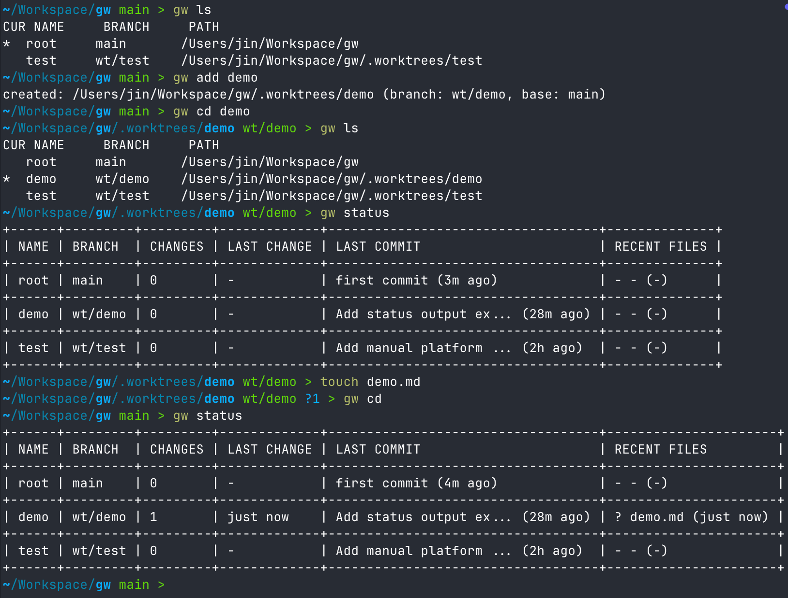

> Fork of [golbin/gw](https://github.com/golbin/gw) with:
> - Monorepo/subdir support — navigate and execute within specific subdirectories per worktree
> - Improved configurability — `gw config`, `gw subdir`, editable config via `gw config -e`
> - Autocomplete for `gw cd`

# gw

gw is a cross-platform CLI that wraps `git worktree` for multi-agent/parallel work management.

Examples:



## Local dev

- Local deploy: `cargo install --path /home/ubuntu/logan/gw`
    - Build release -> Replacing `/root/.cargo/bin/gw`
- Shell integration for `gw cd`: `gw shell-init --install`
- Apply for current session
    - `gw shell-init fish | source`


## Install

### Homebrew

```bash
brew install khanrc/tap/gw
```

### Scoop

```powershell
scoop bucket add khanrc https://github.com/khanrc/scoop-bucket
scoop install gw
```

### install.sh (macOS/Linux)

```bash
curl -fsSL https://raw.githubusercontent.com/khanrc/gw/main/install.sh | bash
```

## Quick start

```bash
gw add demo
gw cd demo
touch demo.md
gw status
gw apply demo
```

Tip: jump to repo root with `gw cd` (or `gw cd root`).

Common navigation:

```bash
gw cd root
gw cd <name>
```

## Shell integration (recommended)

Install a wrapper so `gw cd` changes the current shell directory. This auto-detects your shell and installs without prompts:

```bash
gw shell-init --install
```

Fully automatic (install + apply for current session):

```bash
eval "$(gw shell-init)"
```

To print the integration script without installing, run `gw shell-init <shell>` (bash/zsh/fish/powershell).

## Command quick reference

This table is the fastest way to learn the core commands, shortcuts, and aliases.

| Command                   | Alias             | Shortcut               | Description                        |
| ------------------------- | ----------------- | ---------------------- | ---------------------------------- |
| `gw add <name>`           | `gw new <name>`   | `gw a <name>`          | create worktree                    |
| `gw del <name>`           | `gw rm <name>`    | `gw d <name>`          | remove worktree                    |
| `gw list`                 | `gw ls`           |                        | list worktrees                     |
| `gw status`               |                   | `gw st`                | status snapshot                    |
| `gw apply <name>`         | `gw merge <name>` | `gw ap <name>`         | apply result (merge/squash/rebase) |
| `gw sync <name>`          |                   | `gw sy <name>`         | update base then sync              |
| `gw sync --all`           |                   | `gw sy -A`             | sync all                           |
| `gw verify <name>`        |                   | `gw v <name>`          | verification bundle                |
| `gw note <name> "<text>"` |                   | `gw n <name> "<text>"` | add note                           |
| `gw info <name>`          | `gw show <name>`  | `gw i <name>`          | view notes/meta                    |
| `gw lock <name>`          |                   | `gw lk <name>`         | lock from delete/cleanup           |
| `gw unlock <name>`        |                   | `gw ul <name>`         | unlock                             |
| `gw gc`                   |                   | `gw g`                 | print cleanup candidates           |
| `gw cd <name>`            |                   | `gw c <name>`          | output worktree path               |
| `gw exec <cmd>`           |                   | `gw x <cmd>`           | run command on worktrees           |

## Detailed usage

### Global options

```
-h, --help     show help
-V, --version  show version
-v, --verbose  verbose output
-q, --quiet    minimal output (errors only)
--color <when> color output (auto, always, never)
--json         JSON output (supported commands only)
```

### gw add <name>

Create a worktree.

Options:

```
-b, --base <branch>    base branch (auto if omitted)
-B, --branch <branch>  branch name to create/use (default: wt/<name>)
--path <dir>           worktree path (default: .worktrees/<name>)
```

### gw del <name>

Remove a worktree.

Options:

```
-f, --force          remove even if dirty
-D, --delete-branch  delete branch too
```

### gw list

List worktrees (git worktree list).

### gw status

Show a pretty table with branch, dirty summary, last commit, and the most recent
uncommitted file changes with human-readable time.

Options:

```
--changes-detail  show staged/unstaged/untracked breakdown
--recent <n>      max recent files to show (default: 3)
```

### gw apply <name>

Apply a worktree branch into a target.

Options:

```
-t, --target <branch>  target branch (default: current)
--merge                merge with --no-ff (default)
--squash               merge with --squash
--rebase               rebase onto target
-c, --cleanup           cleanup worktree and branch on success
```

### gw sync <name> / gw sync --all

Sync worktree branches to the latest base.

Options:

```
--base <branch>  base branch (auto if omitted)
--rebase         rebase (default)
--merge          merge instead of rebase
-A, --all        target all worktrees
```

### gw verify <name>

Run verification commands (test/lint/typecheck) based on project type.

### gw note <name> "<text>"

Add a note to the worktree metadata.

### gw info <name>

Show worktree metadata and notes.

### gw lock <name> / gw unlock <name>

Lock or unlock a worktree from delete/cleanup/gc.

### gw gc

Print cleanup candidates (use `--prune` to delete).

### gw cd <name>

Print worktree path for shell integration.

Use `gw cd` or `gw cd root` to print the repo root.

With shell integration installed, `gw cd <name>` also changes the current shell directory.

### gw exec <cmd>

Run a command across worktrees.

Options:

```
-A, --all          target all worktrees (default)
-w, --worktree     target specific worktrees (repeatable)
--parallel         run in parallel (default: sequential)
--fail-fast        stop on first failure
```

### gw completion <shell>

Generate shell completion scripts.

## Configuration

### Environment variables

```
GW_HOME           gw config/tools directory (default: ~/.gw)
GW_DEFAULT_BASE   default base branch
GW_WORKTREES_DIR  worktree root directory name (default: .worktrees)
GW_LOG            log level: error|warn|info|debug|trace (default: warn)
GW_NO_COLOR       disable color when set to 1
```

### Config files

- Global: `~/.gw/config.toml`
- Project: `<repo_root>/.gw/config.toml` (overrides global)

Example:

```toml
[defaults]
base = "main"
worktrees_dir = ".worktrees"
branch_prefix = "wt/"

[gc]
stale_days = 7

[verify]
rust = "cargo test"
node = "npm test"
python = "pytest"
```

### Metadata and locks

```
<repo_root>/.gw/
├── config.toml
├── meta.json
└── locks/
    └── <name>.lock
```

## Requirements

- Git 2.20+
- Rust 1.70+ (for builds)

## License

MIT

## Development

```bash
cargo build
cargo check
```
